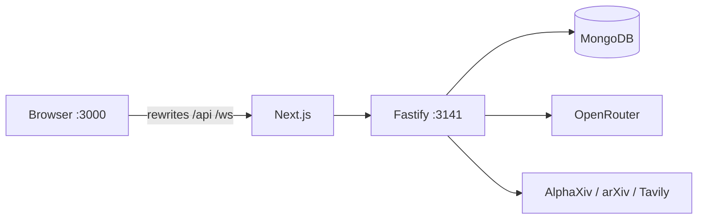
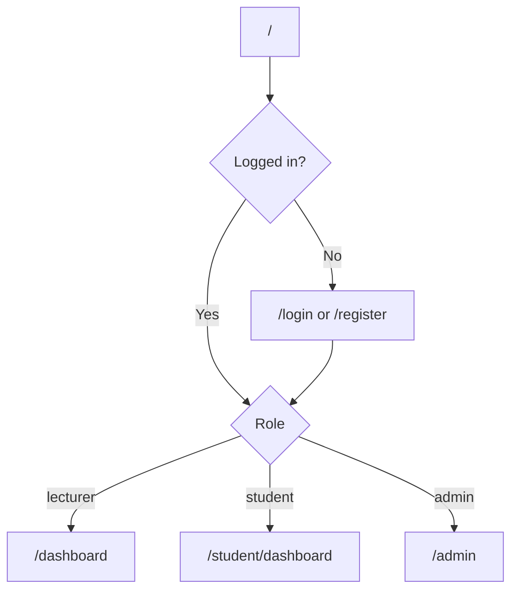
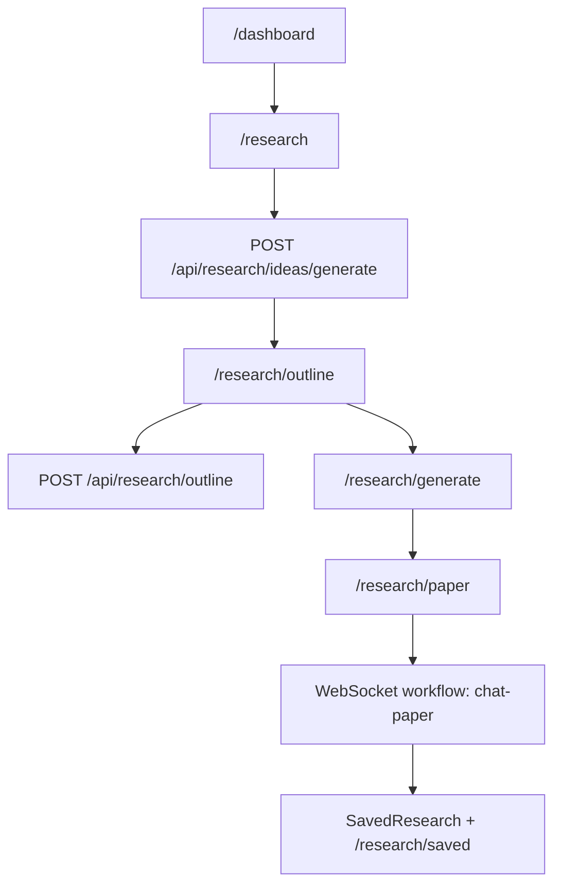
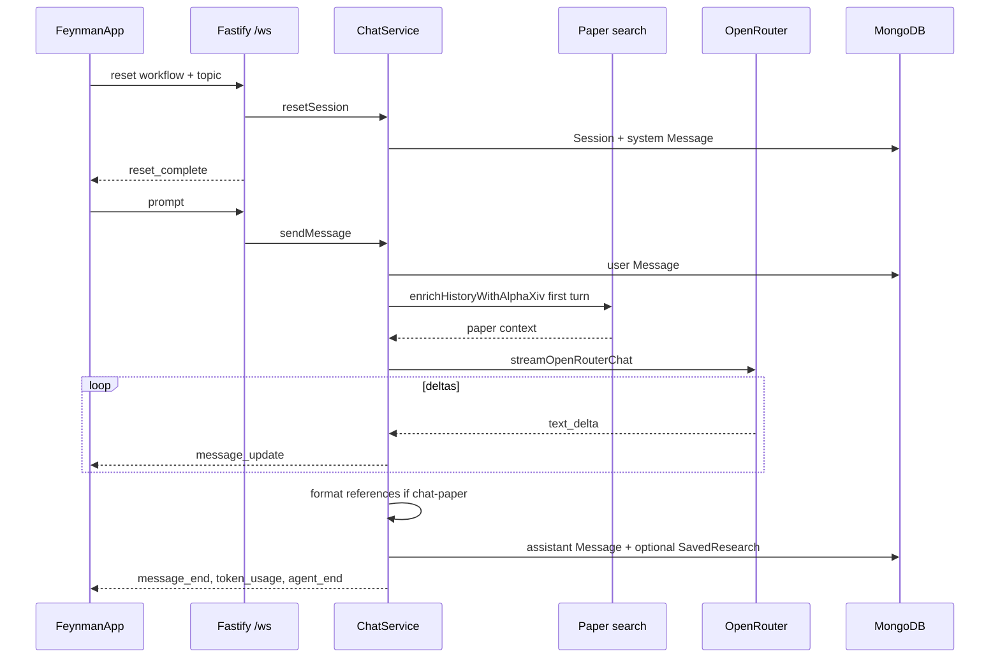
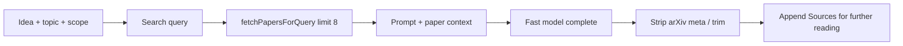
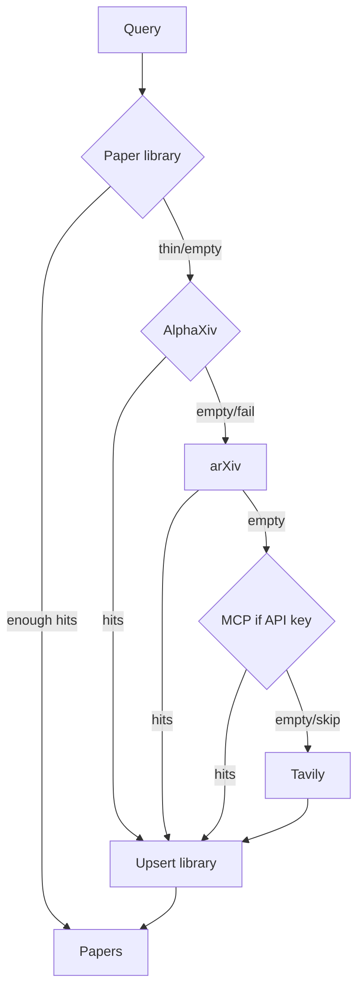

# Project Workflow — Governed AI for Higher Institutions (GAHI)

End-to-end workflows for the GAHI research platform: user journeys, agentic chat pipeline, research features, and local development.

---

## Architecture (dev)



| Layer | Stack | Default URL |
|-------|--------|-------------|
| Frontend | Next.js 16, React 19 | http://localhost:3000 |
| Backend | Fastify 5, TypeScript | http://127.0.0.1:3141 |
| Database | MongoDB (Mongoose) | `mongodb://127.0.0.1:27017/feynman` |
| AI | OpenRouter | — |
| Real-time | WebSocket `/ws` | proxied via Next |

---

## 1. User journeys

### Landing → auth → dashboard



1. Public landing (`/`) → register or login.
2. Auth APIs: `POST /api/auth/login`, `/register`, `/register-student`.
3. Role routing (`lib/dashboard-routes.ts`):
   - student → `/student/dashboard`
   - lecturer / researcher → `/dashboard`
   - admin → `/admin`

### Lecturer research (canonical product flow)



| Step | Route / API | What happens |
|------|-------------|--------------|
| 1. Ideas | `/research` | Discipline, topic, scope → generated research ideas |
| 2. Outline | `/research/outline` | Literature-backed Markdown outline |
| 3. Configure | `/research/generate` | Citation style and paper options |
| 4. Draft | `/research/paper` | WebSocket `chat-paper` streams full paper |
| 5. Library | `/research/saved` | Persisted papers |

Student path mirrors this under `/student/research/*` (`variant="student"`).

### Other product surfaces

| Flow | Paths |
|------|--------|
| Paper drafting | `/research/paper` → `FeynmanApp` |
| Research Note | `/research/note` → notebook (notes, data, figures, lab log, AI drafts); Mongo projects + OpenRouter via `llm.service` |
| Lesson planner | `/lesson-planner` → choose mode (outline / session / activities / rubric) → generate → optional presentation → save |
| References | `/references` |
| Admin | `/admin` — ops (users, sessions, tokens, lectures, backup) + AI governance (analytics, policies, audit, approvals, Management/Senate reports) |


---

## 2. Agentic chat pipeline

Runtime is implemented in `backend/src/services/chat.service.ts`. Workflow prompts under `backend/prompts/` condition the LLM via the system message; literature search + streaming are the executed “agent” loop.



### Pipeline steps

1. **Session** — `reset` loads workflow prompt (or default), creates Mongo `Session` + system `Message`.
2. **User message** — persist turn; assert student token balance when applicable.
3. **Literature** (first user turn only, for research workflows) — AlphaXiv → arXiv → AlphaXiv MCP → Tavily; inject into system context.
4. **LLM stream** — OpenRouter SSE; emit `message_update` deltas over WebSocket.
5. **Post-process** — for `chat-paper`: format references, auto-save if content ≥ 400 chars, deduct tokens.

### WebSocket protocol

**Client → server**

| Message | Purpose |
|---------|---------|
| `{ type: "reset", workflow?, topic?, message? }` | New session / workflow |
| `{ type: "prompt", message }` | User turn |
| `{ type: "abort" }` | Cancel run |

**Server → client**

| Message | Purpose |
|---------|---------|
| `connected` | Status + workflow list |
| `agent_event` | `agent_start`, `tool_execution_*`, `message_update`, `message_end`, `token_usage`, `agent_end` |
| `reset_complete` / `prompt_complete` / `aborted` / `error` | Lifecycle |
| `student_token_quota` | Remaining tokens |

**Paper client sequence** (`useFeynmanSocket.sendResearchPaper`):

1. `reset` with `workflow: "chat-paper"` and `topic`
2. On `reset_complete`, send `prompt` with the full paper prompt (outline embedded)

---

## 3. Research workflows (prompts)

Prompts live in `backend/prompts/*.md`. `backend/src/services/workflows.ts` loads them; commands with `topLevelCli: true` are listed via `GET /api/workflows` and WebSocket `connected`.

| Command | Description |
|---------|-------------|
| `/chat-paper` | Full academic paper with inline citations (primary UI path; not listed as CLI) |
| `/deepresearch` | Multi-step investigation protocol (plan → gather → draft → cite → review → deliver) |
| `/lit` | Literature review grounded in retrieved papers |
| `/draft` | Structured paper-section drafting |
| `/compare` | Side-by-side study comparison |
| `/summarize` | Concise topic/paper summary |
| `/review` | Critical academic review |
| `/audit` | Citation / integrity audit |
| `/autoresearch` | Autonomous experiment-style loop |
| `/watch` | Monitor a topic for new developments |
| `/log` | Session journaling |
| `/replicate` | Replication planning |
| `/recipe` | Step-by-step methodology builder |
| `/jobs` | Background task inspection |

Literature auto-injection applies to research-oriented workflows (e.g. `chat-paper`, `lit`, `deepresearch`, `draft`, `compare`, `review`, …). `log` and `jobs` skip it.

> **Note:** Prompt text may describe tools like `web_search` or subagents. The Fastify runtime does not run a general tool-calling loop; it uses literature enrichment + LLM streaming. Prompts still shape output structure and quality.

### Deep research protocol (prompt-level)

When `/deepresearch` is selected, the system prompt instructs a 7-step protocol:

1. Plan → 2. Scale → 3. Gather evidence → 4. Draft → 5. Cite → 6. Review → 7. Deliver

---

## 4. Outline generation

**API:** `POST /api/research/outline`  
**Service:** `backend/src/services/outline.service.ts`



1. Build query from topic + idea title + discipline.
2. Fetch up to 8 papers (AlphaXiv → arXiv → MCP → Tavily).
3. Inject abstracts into the outline prompt.
4. Complete with the fast model (`FEYNMAN_FAST_MODEL`).
5. Post-process and append sources; deduct tokens; optionally persist `SavedResearchOutline`.

---

## 5. Paper drafting & save

1. Ideas: `POST /api/research/ideas/generate`
2. Outline: as above
3. Generate page stages prompt + citation style → `/research/paper`
4. `prepareResearchPaperPrompt` embeds outline + IMRaD + citation style
5. WebSocket `chat-paper` streams the paper
6. Dual persistence:
   - **Backend:** `ChatService` → `SavedResearch` when long enough
   - **Frontend:** `lib/chat-research-storage.ts` → API and/or localStorage

---

## 6. Literature sources (library-first RAG)



Priority: **Paper library (Mongo)** → if fewer than `PAPER_LIBRARY_MIN_HITS` (default 4) → **AlphaXiv** → **arXiv** → **AlphaXiv MCP** (if keyed) → **Tavily**. New API hits are upserted (deduped by arXiv ID / title) for reuse.

---

## 7. Backend map

| Concern | Key files |
|---------|-----------|
| Server / WS / routes | `backend/src/server.ts`, `backend/src/index.ts` |
| Chat | `backend/src/services/chat.service.ts` |
| LLM | `backend/src/services/llm.service.ts` |
| Workflows | `backend/src/services/workflows.ts`, `backend/prompts/` |
| Literature | `alphaxiv.service.ts`, `arxiv.service.ts`, `tavily.service.ts` |
| Outline / ideas | `outline.service.ts`, `research-ideas.service.ts` |
| Saved papers | `research.service.ts` |
| Auth / tokens | `auth.service.ts`, `student-token.service.ts` |
| Models | `backend/src/db/models/*` |

### Token quotas

| Role | Quota |
|------|--------|
| Student | 400,000 |
| Lecturer / researcher | 1,000,000 |

---

## 8. Local development workflow

### Prerequisites

- Node.js `>=20.19.0 <26` (see `.nvmrc`)
- MongoDB running locally or remote URI

### Install

```bash
npm install
cd backend && npm install
```

### Environment

Copy `.env.example` to `.env` and/or `backend/.env`. Required / common vars:

| Variable | Role |
|----------|------|
| `OPENROUTER_API_KEY` | Required for AI |
| `MONGODB_URI` | Database |
| `PORT` | Backend port (default `3141`) |
| `FEYNMAN_MODEL` | Main chat model |
| `FEYNMAN_FAST_MODEL` | Outlines / ideas |
| `AUTH_SECRET` | JWT signing |
| `ALPHAXIV_*` / `TAVILY_*` | Literature sources |
| `PAPER_LIBRARY_ENABLED` | Local RAG library before live APIs (default on) |
| `PAPER_LIBRARY_MIN_HITS` | Min library hits to skip APIs (default `4`) |

### Run

```bash
npm run dev           # Frontend → http://localhost:3000
npm run dev:backend   # Backend  → http://127.0.0.1:3141
```

Next rewrites `/api/*` and `/ws` to the backend in development.

### Build / production

```bash
npm run build:all
npm run start         # Serves backend (and static export when present)
```

---

## Quick reference — key frontend paths

| Concern | Paths |
|---------|--------|
| Branding / nav | `lib/brand.ts`, `lib/aula-nav.ts`, `lib/dashboard-routes.ts` |
| Research UI | `components/ResearchAssistant.tsx`, `components/research/*`, `components/FeynmanApp.tsx` |
| Chat client | `hooks/useFeynmanSocket.ts`, `lib/agent-events.ts`, `lib/prepare-research-paper.ts` |
| API helpers | `lib/api.ts`, `lib/research-api.ts`, `lib/chat-research-storage.ts` |
